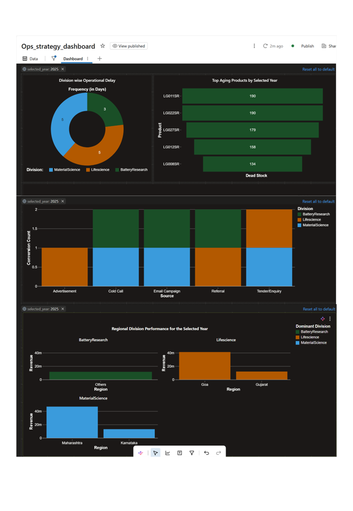

# Operational Strategy & Cloud Analytics Suite

This repository showcases the cloud-based data engineering and analytics pipeline for the **Operational Strategy Dashboard**. It focuses on scalable data processing using **Databricks** and **PySpark**, coupled with a dynamic visual layer for business intelligence.

### 🛠 Tech Stack & Tools
* **Cloud Platform:** Databricks (Unified Data Analytics Platform)
* **Data Engineering:** PySpark (Large-scale data processing & transformation)
* **Query Language:** SQL (Complex analytical transformations)
* **Version Control:** Git/GitHub
* **Visualization:** Databricks SQL Dashboards

### 🚀 Pipeline Architecture
This project implements a modular **Bronze-to-Gold** data architecture:
1.  **Bronze (Ingestion):** Raw data ingestion.
2.  **Silver (Cleaning):** Data validation and transformation using PySpark.
3.  **Gold (Aggregation):** Optimized SQL-based aggregation.

### Data Modeling Strategy
To ensure optimal performance and intuitive analysis within Power BI and Tableau, I architected the data models using a **Star Schema** approach:

- **Fact Tables:** Centralized core metrics (e.g., Revenue, Inventory levels, Sales transactions) to maintain a singular source of truth.
- **Dimension Tables:** Denormalized descriptive attributes (e.g., Product categories, Regional hierarchies, Time dimensions) to facilitate fast filtering and drill-down analysis.
- **Architecture Rationale:** By implementing a Star Schema over a more complex Snowflake model, I significantly reduced join complexity, resulting in faster dashboard load times and a more user-friendly interface for executive reporting. 

### 🔗 Live Dashboard
[Click here to view the published Dashboard](https://dbc-ff77c2ff-625c.cloud.databricks.com/dashboardsv3/01f15b545b3b16b5b2dbe9ca45dacd45/published?o=7474649180749334)

### 📊 Dashboard Preview

---
*Part of a larger enterprise full-stack ecosystem. View the full suite architecture [here](https://github.com/swathi888-star/enterprise-inventory-management).*
